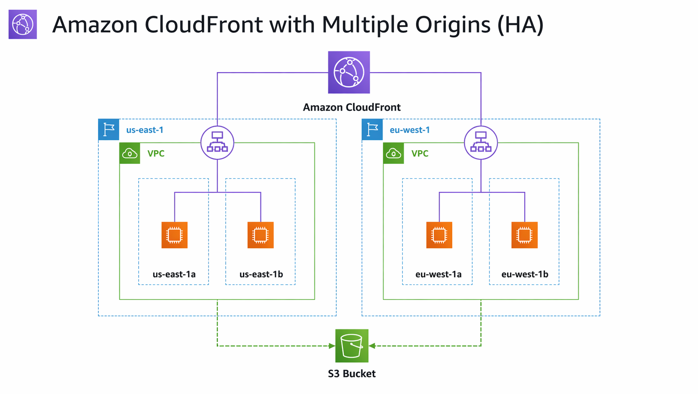

# CloudFront with Multiple Origins

---

##  Business Use Case

Businesses need their applications to stay fast and available no matter where their users are in the world. Any slowdown or regional outage can lead to lost revenue, poor customer experience, and operational disruption. CloudFront helps solve this by pushing content out to edge locations around the world and automatically routes users to the healthiest origin.

With CloudFront origin failover, organizations can maintain high availability across regions and ensure uninterrupted access even during infrastructure failures.

This lab guide demonstrates how to build an Amazon CloudFront distribution with multiple custom origins backed by Application Load Balancers and EC2 instances. You will configure CloudFront origin groups to enable automatic cross-region failover, creating a highly available architecture.

To validate the setup, you will simulate a network failure that triggers a cross-region failover from one of the load balancers to the other.

##  Requirements (Prerequisites)

- AWS Free Tier Account  
- Basic exposure to the AWS Console and completion of prior learning  

---

##  Resources

See **"cloudfront-lab-files"** in the GitHub repository.

---

##  Exercise Overview

- **Exercise 1** – Create the S3 Bucket to host the website code  
- **Exercise 2** – Create the US and UK Website EC2 instances  
- **Exercise 3** – Create the Application Load Balancers  
- **Exercise 4** – Create the CloudFront Distribution  
- **Exercise 5** – Test the solution by simulating a network failure  
- **Exercise 6** – Clean up your resources  

---

#  Exercise 1 – Create the S3 Bucket

## Task 1 – Create the S3 Bucket to host the website code

Create the S3 bucket and populate it with the HTML / CSS code.

1. Go to the Amazon S3 Console and click **Create Bucket**.  
2. First, we will create the S3 Bucket. Call it `s3-website-123456`, with the numbers appended being a random string of numbers.  
3. Select **Create Bucket**.  
4. Once you have created the bucket, click on it. Next, upload the website code from the folder called **cloudfront-lab-files**. Within this folder, you will find two files:  
   - website.css  
   - index.html  
5. Click upload and drag and drop these two files into the folder (not the user data file), and click upload.  

> You should now have an S3 bucket populated with website code that the EC2 instances can download.

---

#  Exercise 2 – Create the Website EC2 Instances

## Task 2 – Create the US Website instances

We will now create the US Website EC2 instances. Remember to create this in the **us-east-1 Region**.

1. First, we'll create the first US Website instance in us-east-1.  
2. Go over to the EC2 console and click **Launch instance**.  
3. Call it `US-Website-1`.  
4. Scroll down and choose **Proceed without a key pair**, leaving the other default options.  
5. Create a security group that gives full access via port 80. Call it `US-Website-SG`.  
6. Choose a public subnet in the us-east-1a availability zone.  
7. We need to create an instance profile to allow EC2 to communicate with S3.  
8. Click **Create new IAM profile** under advanced details.  
9. Click **Create Role**, select EC2, and click next.  
10. Search for **AmazonS3ReadOnlyPolicy** and attach it.  
11. Call the role `CloudFrontEC2S3Role` and create it.  
12. Go back to the EC2 launch page and add the EC2 Role.  
13. Under advanced details, paste in the user data from the resource titled **website user data**.  
14. Replace `YOUR-BUCKET-HERE` with your actual bucket name.  
15. Launch the instance.  
16. Repeat the same steps to launch the second instance:
    - Name: `US-Website-2`  
    - Availability Zone: `us-east-1b`  
17. Test the EC2 instances using their public IPs.  

---

## Task 3 – Create the UK Website EC2 instances

We will now create the UK Website EC2 instances. Remember to create this in the **eu-west-1 Region**.

1. Launch:
   - `UK-Website-1` (eu-west-1a)  
   - `UK-Website-2` (eu-west-1b)  
2. Use the same user data.  
3. Create a security group called `UK-Website-SG` with the same rules.  
4. Test access via public IPs.  

> This shows which availability zone the instances are in and will help validate failover later.

---

#  Exercise 3 – Create the Application Load Balancers

## Task 4 – Create the US Website ALB

1. Go to EC2 → **Target Groups**.  
2. Choose instances as the target type.  
3. Call it `USWebsiteTargetGroup`.  
4. Add both US Website instances.  
5. Click **Create Target Group**.  
6. Go to **Load Balancers → Create Load Balancer**.  
7. Choose **Application Load Balancer**.  
8. Call it `USWebsiteLoadBalancer`.  
9. Select availability zones:
   - us-east-1a  
   - us-east-1b  
10. Remove default security group and select `US-Website-SG`.  
11. Select `USWebsiteTargetGroup` for listener on port 80.  
12. Click **Create Load Balancer**.  

> You should now be able to use the DNS name and see traffic cycle across instances.

---

## Task 5 – Create the UK Website ALB

1. Repeat the same steps:
   - Target Group: `UKWebsiteTargetGroup`  
   - Load Balancer: `UKWebsiteLoadBalancer`  
2. Use availability zones:
   - eu-west-1a  
   - eu-west-1b  
3. Attach `UK-Website-SG`.  

> Test DNS to confirm load balancing.

---

#  Exercise 4 – Create the CloudFront Distribution

## Task 6 – Create the CloudFront Distribution

1. Go to CloudFront → **Create Distribution**.  
2. Under **Origin domain**, select the US Load Balancer.  
3. Under cache settings, select **Caching Disabled**.  
4. Click **Create Distribution**.  
5. If prompted for WAF, choose **Do not enable security protections**.  

---

## Task 7 – Create the origin and origin group

1. Go to your distribution → **Origins**.  
2. Click **Create origin** and add the UK ALB.  

>  Make sure both origins use HTTP (not HTTPS)

3. Click **Create origin group**.  
4. Add both origins (US first).  
5. Call it `lab-origin-group`.  
6. Select **504 Gateway Timeout**.  
7. Create the origin group.  
8. Go to **Behaviors** and edit default behavior.  
9. Change origin to the **origin group**.  
10. Save changes.  
11. Access the CloudFront domain.  

> You should see the website delivered from the us-east-1 Region.

---

#  Exercise 5 – Test the Solution

## Task 8 – Test the solution

1. Go to EC2 in us-east-1.  
2. Open `US-Website-SG`.  
3. Remove the HTTP rule (port 80).  

> This simulates a failure and triggers a 504 error.

4. Refresh the CloudFront URL.  

> You should see failover to the UK region.

---

#  Exercise 6 – Clean Up

## Task 9 – Delete the resources

1. Disable the CloudFront distribution.  
2. Delete the distribution.  
3. Delete:
   - Load balancers  
   - Target groups  
   - EC2 instances  
   - S3 buckets  