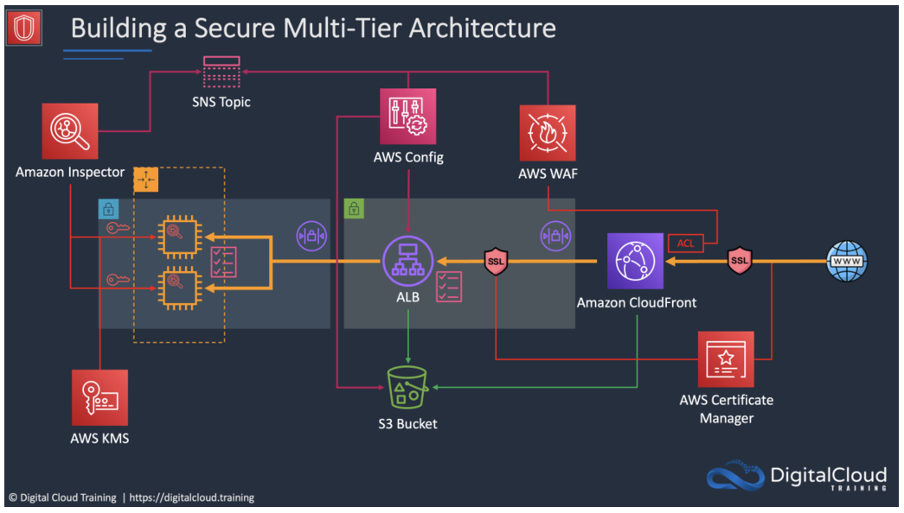

# Building a Secure Multi-Tier Architecture

### Business Use Case

When you’re building in the cloud, relying on a single security control just isn’t enough. Threats change, environments shift, and issues can pop up at any layer. That’s why security really works best when it’s done in layers. Each layer adds another line of defense, and together they help protect your applications, data, and infrastructure from different angles.

A multi‑tier architecture naturally supports this approach. By separating workloads, isolating components, and applying controls at each level, you reduce the blast radius if something goes wrong. Even if one layer is compromised, the others are still there to protect the rest of the environment.

This project is meant to show the thought process behind designing secure cloud architectures. It highlights how AWS services work together to create a layered, **defense‑in‑depth model** that aligns with the **AWS Well‑Architected Framework’s Security Pillar**. It’s a small example of the many ways you can secure a cloud environment, but it gives you a solid foundation for thinking about security at multiple levels.

### Lab Instructions

**Note:** The full hands‑on lab guide is located in the docs folder under the main project directory called aws-secure-multitier-architecture/docs

The lab walks through the process of building a secure multi‑tier application using a combination of AWS security, networking, and compute services. This example architecture is intentionally scoped to demonstrate core concepts, but it can be expanded with additional services and complexity as needed.

## AWS Services Used in This Architecture

Amazon CloudFront – Content delivery with edge‑level security

Application Load Balancer – Layer 7 routing and traffic inspection

AWS Certificate Manager – TLS/SSL certificate management

Amazon SNS – Notifications and event messaging

Amazon EC2 – Compute layer for application servers

Amazon KMS – Encryption key management

Amazon S3 – Secure object storage

Amazon Inspector – Automated vulnerability scanning

AWS Config – Continuous compliance and configuration monitoring

AWS WAF – Web application firewall for threat mitigation
