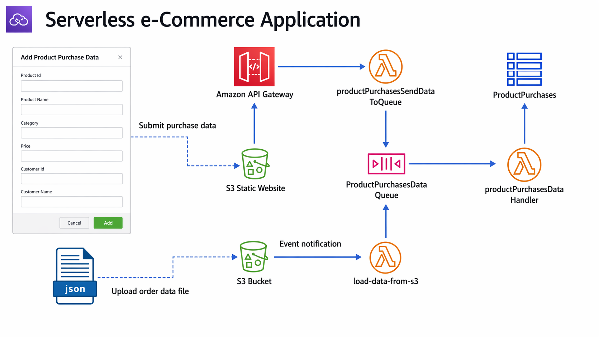

# Building a Serverless App

> 📁 **Lab instructions are located in the "docs" folder:**  
> **[Lab Instructions](./docs)**

### Business Use Case

Serverless architectures are becoming a go‑to option for teams that want to move fast without managing servers or worrying about scaling. For many businesses, the challenge isn’t just building an application — it’s building something that’s cost‑efficient, resilient, and easy to maintain as the company grows. Serverless solves a lot of those problems by letting you focus on the logic of your application instead of the infrastructure behind it.

This project walks through a simple but realistic example of how a business might use serverless services to process incoming data, automate workflows, and store information. The goal is to show the thought process behind designing a serverless workflow and how different AWS services work together to create a clean, event‑driven architecture. It’s a great starting point for understanding how serverless apps are built in the real world and how they can support business needs without adding operational overhead.

## AWS Services Used in This Architecture

- **Amazon SQS** – Fully managed message queue for decoupling application components and handling asynchronous workloads.

- **AWS Lambda** – Event‑driven compute service that runs code automatically in response to API calls, queue messages, or other triggers.

- **Amazon DynamoDB** – Serverless NoSQL database designed for fast, scalable storage of application data.

- **Amazon S3** – Durable object storage used to host the static website and serve frontend content.

- **Amazon API Gateway** – Managed API service that receives requests from the S3 website and triggers backend Lambda functions.

