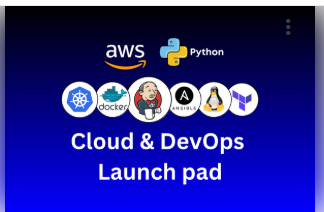

# IT & Cloud Engineering Foundations  
### (Cloud and DevOps Launch Pad)

This course is designed for individuals transitioning into tech or beginning their IT career. It provides a strong technical foundation across Linux, cloud services, automation, and modern tooling. This is an introductory program not deep cloud specialization and additional skills are developed as you continue growing in the IT and cloud ecosystem.

Sample video clips from this course can be found in the folder called "Sample Course Videos"

Below is the full course outline included in this folder.

1. Launch Your First AWS Account  
2. Linux Unlocked: The Essentials  
3. Bash Scripting Essentials  
4. Git Bash Essentials  
5. Mastering the AWS CLI  
6. Draw the Cloud: Visual Diagrams  
7. Hands-On DevOps: Core Skills  
8. Project – WordPress 3‑Tier Deployment on Amazon EC2  
9. Project – Auto‑Scaling Web servers  
10. Visual Studio Code Essentials  
11. Terraform From Scratch  
12. EC2 Autoscaling with Terraform | Project  
13. CI/CD in Action: Git, Pipelines, and Deploys  
14. Python Power‑Up: Code + Real Practice  
15. Lambda Fundamentals: Intro to Serverless  
16. Boto3: Python Talks to AWS  
17. AWS Lambda Project: Event‑Driven with S3 & SNS  
18. EC2 Instance Scheduler | Project  
19. Docker Container Fundamentals  
20. Build & Run with Amazon ECS + Fargate | Project  
